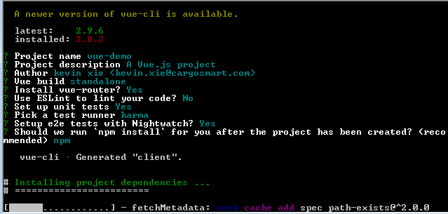
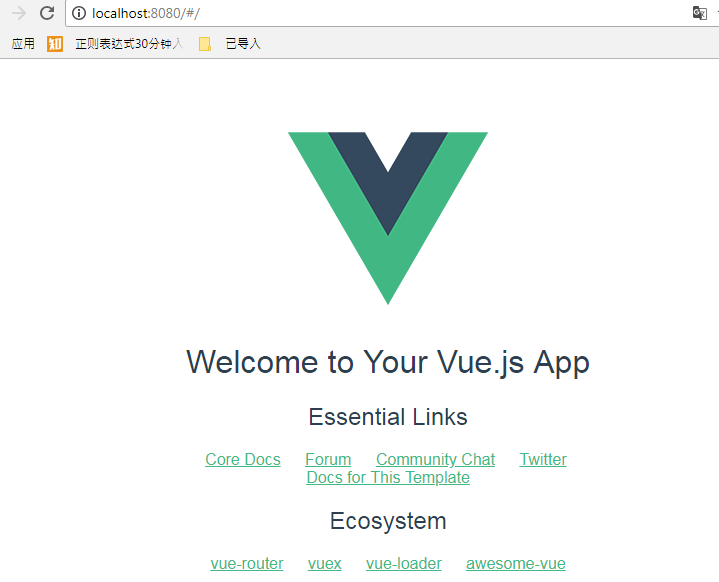

# Vue-cli

Vue-cli 是 Vue 官方提供的工具，用于快速生成前端开发的脚手架。 结合了Webpack可以方便的进行打包，并且配置好了babel loader， 可以方便的使用ES6

## 安装

* npm install -g vue-cli

* vue init webpack client

* cd client

* npm run 

    

* cd client 

* npm run dev  ==> 浏览器打开localhost:8080(默认)

    

* npm run build  ==> 自动打包资源到 client/dist 目录下

## 