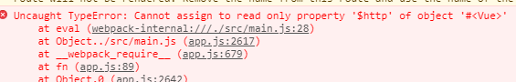

### Problem

1. 尝试用 :src 来绑定 的图片路径， 发现图片一直加载不出来, 打印出来看logo的路径也是正确的, 代码如下：
    ``` javascript
    
    data () {
        return {
            logo: '../../assets/logo.png',
        }
    },
    ``` 
    改成把图片 require 进来就可以了
    ``` javascript
    data () {
        return {
            logo: require('../../assets/logo.png'),
        }
    },
    ``` 

2. Vue-cli 下的静态资源 assets、 static 目录的区别
    * Vue 文件的template、CSS 最终要由webpack loader（vue-html-loader 、 css-loader）进行解析打包
    * 其中的 img  "./logo.png" 会被解析为模块依赖，用 url-loader 和 file-loader 来处理
    * assets 和 static 都是资源目录
    * assets 下面的资源会被 webpack 最终打包到代码里面； static 下面的目录则是直接被复制到打包目录/dist/static 下面
    * 引用 assets 下面的资源用 相对路径，如 '../../assets/logo.png'
    * 引用 static 下面的资源用 绝对路径，由config 决定，如下的config， 则资源路径要写成 /static/[filename]
        ``` javascript
        assetsSubDirectory: 'static',
        assetsPublicPath: '/',
        ```

3. 如何在 Vue 中引入 js 库
    * 例如引入 axios， lodash ...

        ``` javascript
        import Axios from 'axios';
        import _ from lodash;

        // 在Vue 组件中用this._, this.$http 来调用， 但是这种方法容易被不小心覆盖掉， 例如 this._ = "underscore", 可以直接把原来 lodash 覆盖掉
        Vue.prototype.$http = Axios;
        Vue.prototype._ = lodash;   

        // 也是通过this._, this.$http 来调用，这种方法可以有效的防止属性被覆盖
        Object.defineProperty(Vue.prototype, '$http', {value: Axios});
        Object.defineProperty(Vue.prototype, '_', {value: _});
        ```
        


4. 父子组件生命周期顺序
    * 加载渲染过程
        父beforeCreate->父created->父beforeMount->子beforeCreate->子created->子beforeMount->子mounted->父mounted
    * 子组件更新过程
        父beforeUpdate->子beforeUpdate->子updated->父updated
    * 父组件更新过程
        父beforeUpdate->父updated
    * 销毁过程
        父beforeDestroy->子beforeDestroy->子destroyed->父destroyed


5. 父组件异步获取数据， 传递给子组件的渲染问题
    *  渲染父子组件时， 要等所有子组件都 mounted 完了, 父组件才会 mounted
    *  父组件在 mounted 里面进行异步获取数据，所以子组件 mounted 的时候就会拿不到数据
    *  可以在父组件里面给子组件加多一个标志位，等到异步获取到数据之后，再设置 isDataReturn = true。这样会等到拿到数据的时候再渲染子组件。
    ```javascript
        <div style="display: flex;">
            <v-alert-by-severity :result="countBySeverity" v-if="isDataReturn"></v-alert-by-severity>
            <v-alert-by-project></v-alert-by-project>
        </div>
    ```

6. ES6 class this ， 在class 里面的方法调用内部方法


7. 使用webpack.ProvidePlugins 来加载一些工具库，例如jQuery， lodash
    * 在 webpack.base.conf.js 中加入下面代码，则可以在每个vue 文件中直接使用 _ 来引用lodash，而不用每次都去import lodash 然后才能使用
        ``` javascript 
          plugins: [
                new webpack.ProvidePlugin({
                _: 'lodash'
                })
            ],
        ```


8. Morgan 模块
    * 是express 的一个中间件
    * 用来把访问 express 的请求全部log下来
    * 有多种显示模式
    * 可以输出到文件（还能按日期切割log）或数据库
    * __要配置好 Dev 模式和 PROD 模式，PROD 模式log输出的文件__